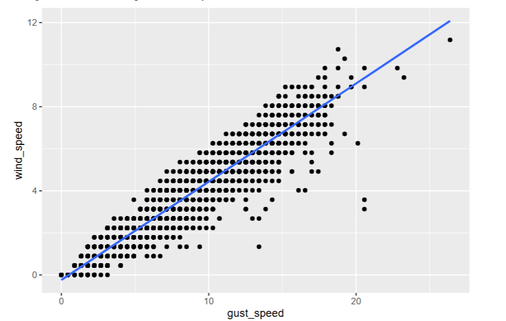
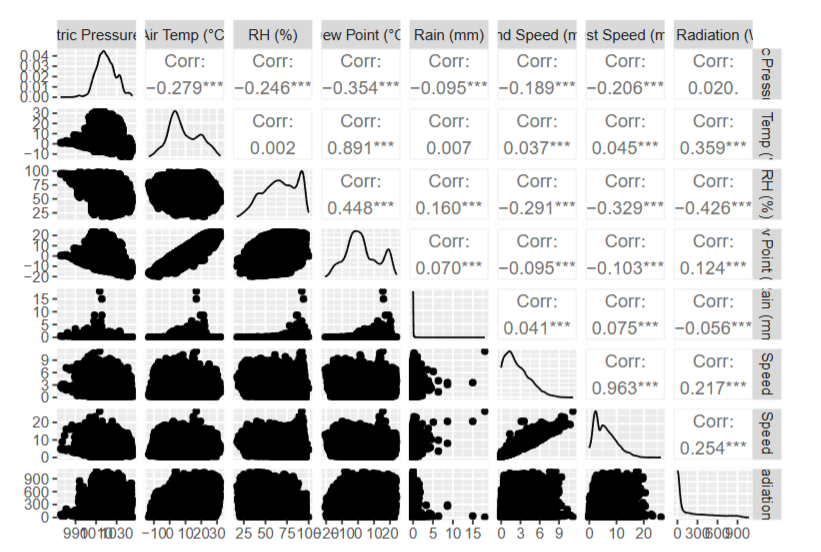
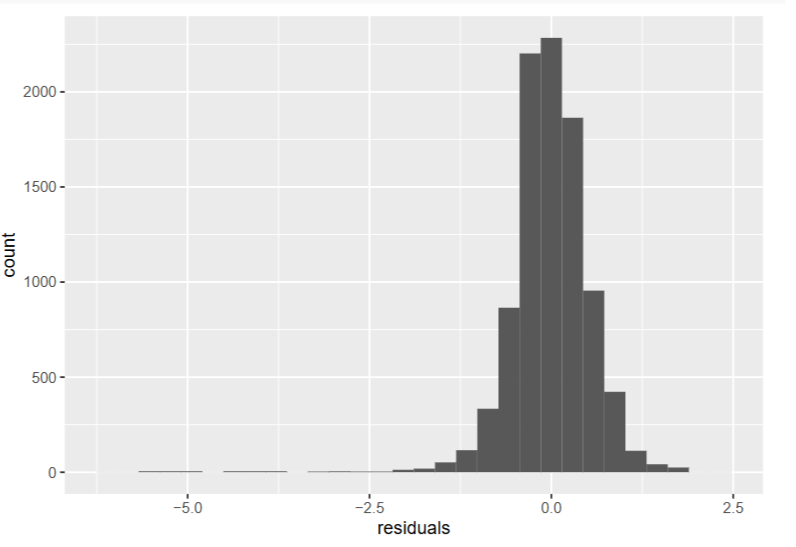
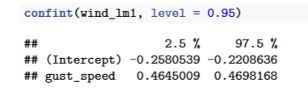
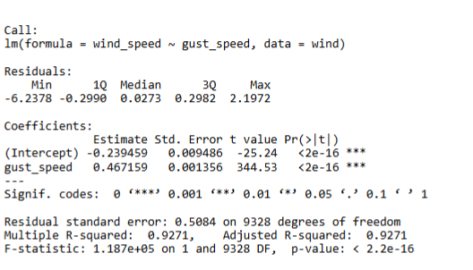

# 📘 Simple Linear Regression: Wind Speed Prediction

## 👩‍💻 Author

**Natali Kostadinovic**  
**Course:** Stat 140  
**Date:** May 6, 2024

---

## 📊 Project Overview

This project investigates whether **gust speed** can predict **wind speed** using **Simple Linear Regression**. The analysis is based on hourly weather data collected at the **Clapp-Library Station** during 2020.

### 🎯 Research Question

> _Is there a statistically significant linear relationship between gust speed and wind speed?_

---

## 📁 Dataset

The dataset contains **9,334 observations** and includes variables like:

- Wind Speed (m/s)
- Gust Speed (m/s)
- Temperature, Humidity, Rainfall, etc.

After cleaning, the final analysis focuses on two continuous variables:

- **Predictor (x):** Gust Speed (m/s)
- **Response (y):** Wind Speed (m/s)

---

## 🔧 Steps in the Analysis

### 1. **Data Cleaning and Preparation**

Relevant columns were selected and renamed for simplicity:

```r
wind <- library_data %>%
  rename(
    wind_speed = `Wind Speed (m/s)`,
    gust_speed = `Gust Speed (m/s)`
  ) %>%
  mutate(
    wind_speed = as.numeric(wind_speed),
    gust_speed = as.numeric(gust_speed)
  ) %>%
  drop_na(wind_speed, gust_speed)
```

---

### 2. **Exploratory Data Analysis**

Initial scatter plot showing the relationship between `gust_speed` and `wind_speed`:



---

### 3. **Regression Model**

A simple linear model was fitted:

```r
lm(wind_speed ~ gust_speed, data = wind)
```

### 🔹 Regression Equation:

```latex
$$
\hat{{wind}} = -0.239351 + 0.467138 \cdot \mathrm{{gust\_speed}}
$$
```

- **Slope (0.467)**: Each 1 m/s increase in gust speed predicts a 0.467 m/s increase in wind speed.
- **Intercept (-0.239)**: Wind speed when gust speed is 0 — not meaningful in real-world terms.

---

### 4. **Model Performance**

- **R² = 0.9271**  
  → 92.71% of the variation in wind speed is explained by gust speed.
- **Correlation (r) = 0.963**  
  → Very strong positive relationship.



---

### 5. **Assumption Checks**

| Assumption             | Status                              |
| ---------------------- | ----------------------------------- |
| Linearity              | ✅ Scatterplot shows a linear trend |
| Normality of Residuals | ✅ Residual histogram looks normal  |
| Constant Variance      | ✅ Residuals are evenly spread      |
| Independence           | ⚠️ Assumed, not formally tested     |



---

### 6. **Hypothesis Test**

- **H₀**: β₁ = 0 (No relationship)
- **H₁**: β₁ ≠ 0 (There is a relationship)
- **P-value = < 2e-16** → Strong evidence to **reject H₀**.

✔️ Conclusion: Gust speed is a statistically significant predictor of wind speed.

---

### 7. **Confidence Interval**

```r
confint(wind_lm1)
```

- **95% CI for slope**: (0.4645, 0.4698)

---

## 🧠 What I Learned

- How to build and interpret a simple linear regression model.
- Importance of checking assumptions before trusting results.
- Why significance levels and hypothesis formulation should be set **before** data exploration.

---

---

## 📏 Confidence Interval for the Slope

We calculated a **95% confidence interval** for the slope coefficient of gust speed using the regression model.

📐 **Result:**

> `0.4645 to 0.4698`

🎯 **Interpretation:**
We are 95% confident that for every 1 m/s increase in gust speed, the average wind speed increases by **between 0.4645 and 0.4698 m/s**.

🧪 Since this interval **does not include 0**, the relationship is statistically significant, gust speed is a **reliable positive predictor** of wind speed.

🖼️ **Screenshot from Analysis:**



---

## 📌 Summary

| Metric          | Value            |
| --------------- | ---------------- |
| Slope (β₁)      | 0.467138         |
| Intercept (β₀)  | -0.239351        |
| R²              | 0.9271           |
| Correlation (r) | 0.963            |
| P-value         | < 2e-16          |
| CI for Slope    | (0.4645, 0.4698) |

---

---

## 📷 Key Visualizations

### 1. 📈 Scatter Plot with Regression Line

Shows the linear relationship between gust speed and wind speed.


---

### 2. 🔗 Correlation Matrix (`ggpairs`)

Displays how wind speed, gust speed, and other variables are correlated.


---

### 3. 📊 Residual Histogram

Assesses whether the residuals (errors) are approximately normally distributed — a key regression assumption.


---

### 4. 📋 Summary Table of Linear Model

Outputs regression coefficients, standard errors, t-values, p-values, and R².



---

### 5. 📏 Confidence Interval Output

This shows the range within which we expect the true slope to lie.

✅ Already included:


---

## 🧪 How to Run

```r
install.packages(c("tidyverse", "janitor", "readxl", "GGally"))
```

Load and knit the R Markdown file `SimpleLinearRegression.Rmd` in RStudio.

---
